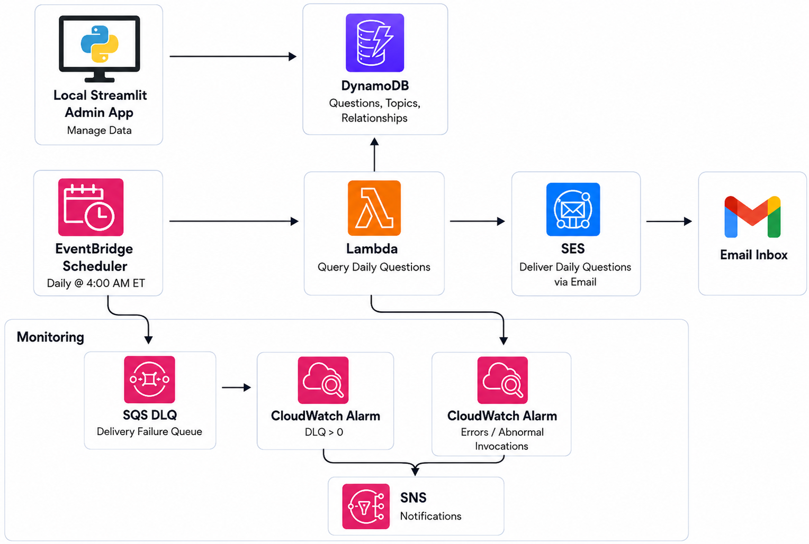
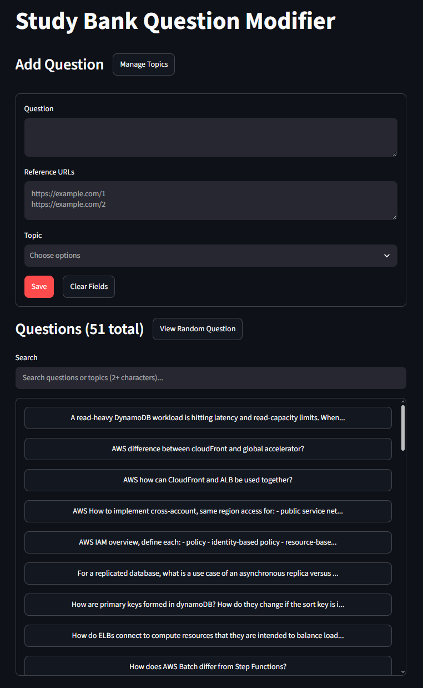

# Study Bank

Study Bank is a personal study tool for managing a bank of technical questions that are automatically delivered by email each day. It uses a local Streamlit application for question management and AWS serverless services for storage, scheduling, delivery, and monitoring.

## Architecture

<p align="center">
  
</p>

## Admin Portal

<p align="center">
  
</p>

# DynamoDB Schema

## Question
- Query on **PK** to retrieve all questions.
- GetItem on **(PK+SK)** to retrieve a specific question.
```json
  "PK": "QUESTION",
  "SK": "550e8400-e29b-41d4-a716-446655440000",
  "question": "When should you use a relational (SQL) database versus a NoSQL database?",
  "reference_url": "https://stackoverflow.com/questions",
```

## Topic
- Query on **PK** to retrieve all topics.
- GetItem on **(PK+SK)** to retrieve a specific topic.
```json
    "PK": "TOPIC",
    "SK": "6c299eca-860e-4654-8194-fc12e045b696",
    "name": "Databases"
```

## Relationship (Adjacency List)
- Query on **PK** to retrieve all relationship items for a topic (shows all questions for a topic).
- Query **QuestionTopicsIndex (keys-only GSI)** with **QuestionTopicsIndex_PK** to retrieve all relationship items for a question (shows all topics for a question).
```json
    "PK": "TOPIC#6c299eca-860e-4654-8194-fc12e045b696",
    "SK": "QUESTION#550e8400-e29b-41d4-a716-446655440000"
    "QuestionTopicsIndex_PK": "QUESTION#550e8400-e29b-41d4-a716-446655440000"